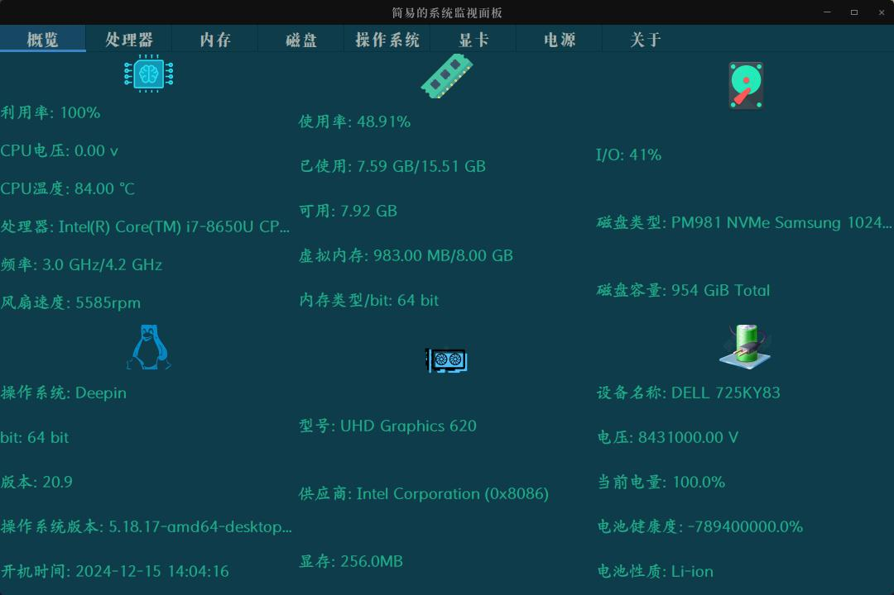
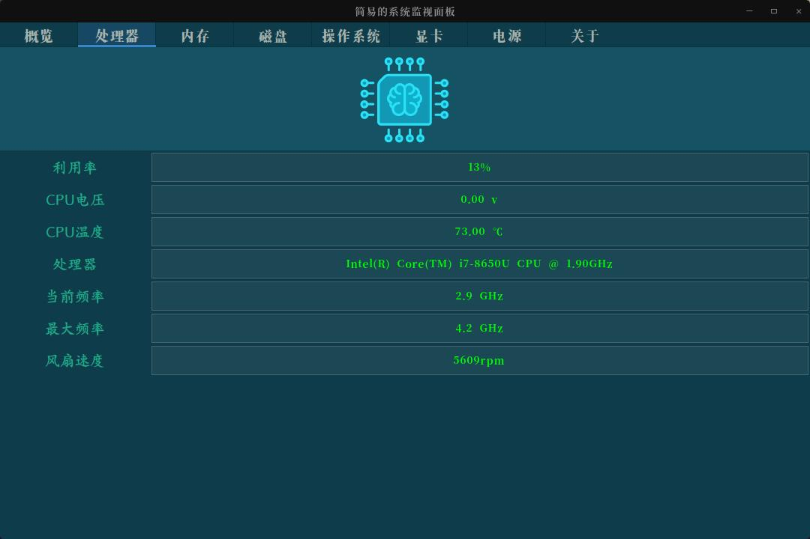

### Htop Panel

##### 简介

使用OSHI模块和FlatLaf开发的一款可视化系统信息面板。

##### 文档

- [OSHI文档](https://github.com/oshi/oshi)
- [FlatLaf - Flat Look and Feel](https://github.com/JFormDesigner/FlatLaf)

##### 网页版

- [WebHtop](https://github.com/mhc2910463910/Web-Htop)

##### 部分截图

##### 更多工具

- [MooInfo](https://github.com/rememberber/MooInfo)

##### 注意事项

> 在运行第一版jar包时，请将压缩包中的img和font目录放置在jar包同目录